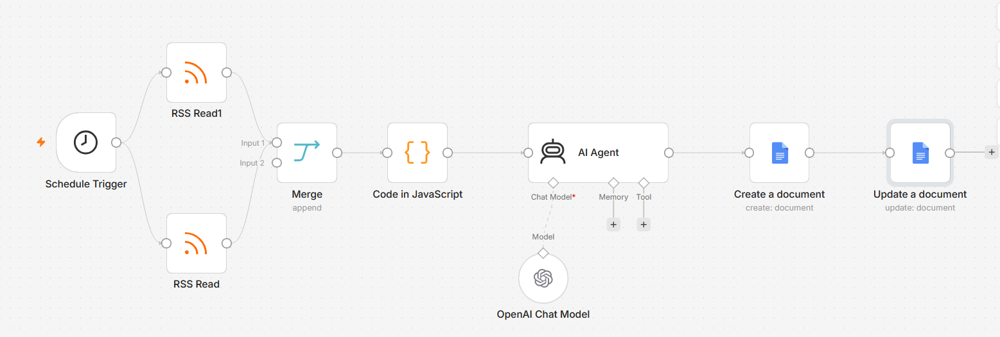

# personal-ai-intelligence-agent
An AI-powered personal news intelligence agent built with n8n and OpenAI that aggregates AI news, prioritizes relevant developments, and generates a daily intelligence briefing.

# Personal AI Intelligence Agent

An automated AI news intelligence system built using n8n and OpenAI.

## Problem

AI developments move extremely quickly. Manually tracking multiple
sources every day is time-consuming and makes it difficult to identify
which developments actually matter.

## Solution

This agent automatically:

1. Collects AI news from credible RSS sources
2. Combines articles from multiple sources
3. Filters and selects the most relevant developments
4. Uses an LLM to analyze the stories
5. Generates business and strategic implications
6. Produces an MBA interview/GD angle
7. Creates a daily Google Docs briefing

## Architecture

Schedule Trigger
        ↓
RSS Sources
        ↓
Merge
        ↓
Article Filtering
        ↓
AI Analyst
        ↓
Google Docs
        ↓
Daily Intelligence Briefing

## Tech Stack

- n8n — workflow orchestration
- OpenAI — LLM reasoning and summarization
- RSS — news ingestion
- Google Docs — output layer
- JavaScript — article filtering and transformation

## Key Features

- Multi-source news aggregation
- Automated article selection
- LLM-based relevance analysis
- Business/strategy implications
- MBA interview/GD preparation
- Automated daily reporting

## Future Improvements

- Deduplication across sources
- Relevance scoring
- Reuters / MIT Technology Review / TechCrunch integration
- Fintech and payments news
- Personal feedback loop
- News credibility scoring
- Notion knowledge base
